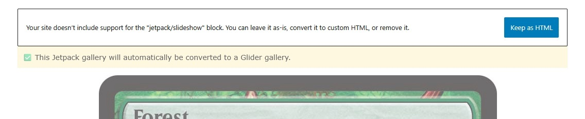

# WP Glider Galleries

**WP Glider Galleries** is a simple WordPress plugin that adds a block to create new [Glider.js](https://github.com/NickPiscitelli/Glider.js) galleries, and replaces Jetpack slideshows in a non-distructive manner.

I used to have Jetpack running on my WordPress instance, but it became more and more bloated over the years. I decided to nuke it, but soon realized that I was making exctensive use of their `jetpack/slideshow` galleries. So instead of reinstalling it just for the sake of having the galleries, I've built this small plugin.

## How it works

A Glider Gallery is a simple block that allows you to select images from the media gallery, and create lightweight slideshows. 
The plugin also looks for existing `jetpack/slideshow` blocks in your articles and converts them at runtime. 

> [!CAUTION]  
> Keep in mind that the original Jetpack block code will never be nuked. WP Glider Gallery will show a warning in the Block editor when one is detected. It will then replace it with a Glider Gallery when the page is loaded.
> 
> 

## Contributing

If you'd like to submit a pull request, please base it off the `develop` branch instead of `main`.
Feel free to open issues if you have ideas, questions, or suggestions.

